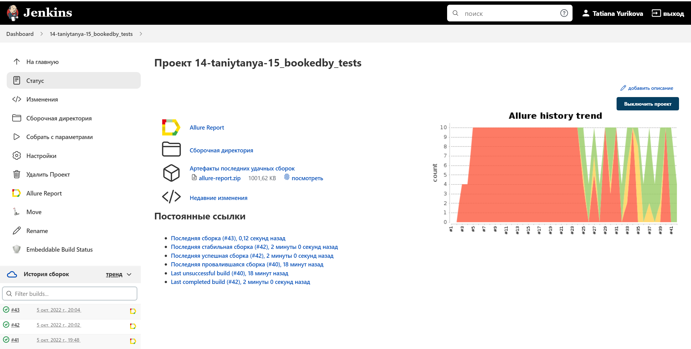
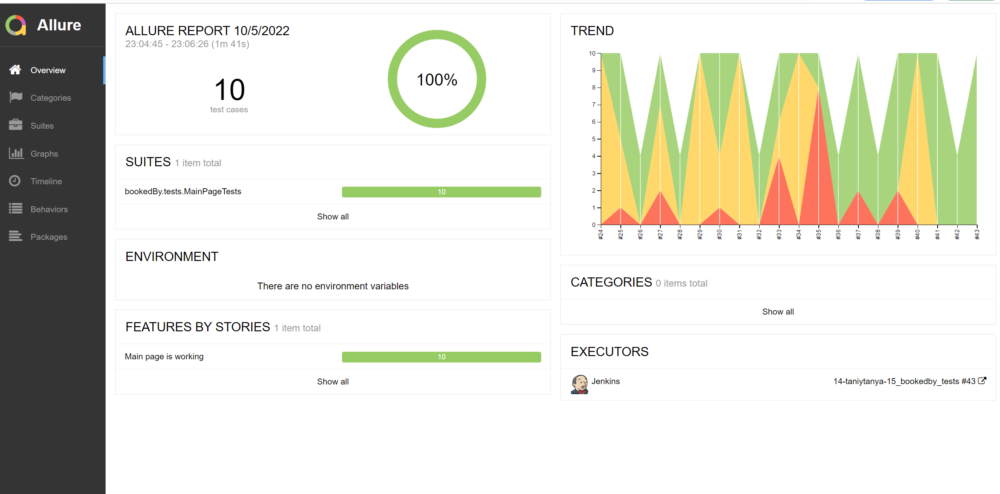
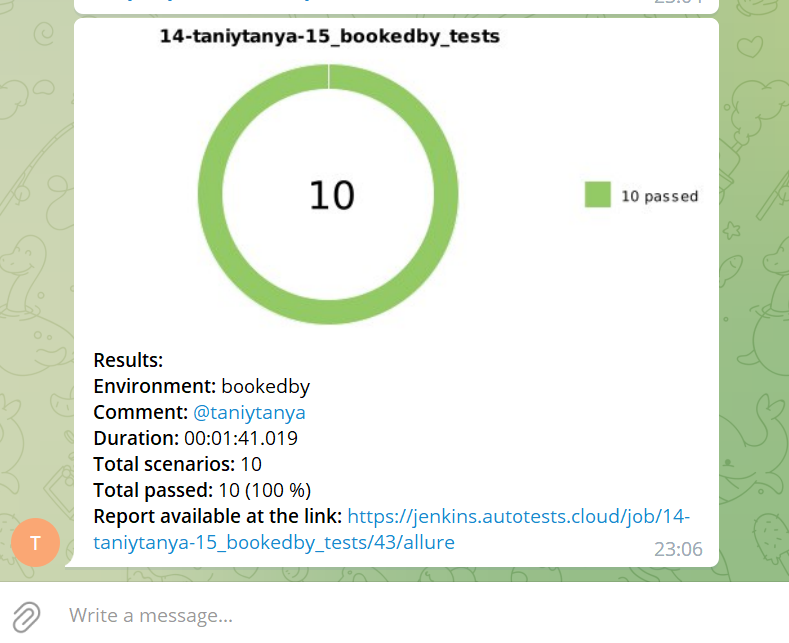

# Project for UI automated testing for bookedby.com
## Contains:

- [Technology stack](#technology-stack)
- [Test run](#test-run)
- [Jenkins build](#jenkins-job)
- [Allure report](#allure-report)
- [Telegram notifications with bot](#telegram-notifications-with-bot)
- [Video of running test with Selenoid](#video-of-running-test-with-selenoid)

## Technology stack

<p align="center">


</p>

Automated tests on <code>Java</code> using <code>JUnit 5</code> and <code>Gradle</code>.
For UI-test was used framework [Selenide](https://selenide.org/).
You can run tests locally or with Jenkins job that use [Selenoid](https://aerokube.com/selenoid/).
Allure report is formed for every running and common results are sent to <code>Telegram</code>.

Allure-report includes:
* steps;
* screenshots;
* Page Source;
* console logs;
* autotest video.

## Test run

### Local test run
With default options
```
gradle clean test
```

You can change options
```
clean
test
-Dbrowser_name=${BROWSER_NAME}
-Dbrowser_version=${BROWSER_VERSION}
-Dbrowser_size=${BROWSER_SIZE}
```

### Remote running

```
clean
test
-Dbrowser_name=${BROWSER_NAME}
-Dbrowser_version=${BROWSER_VERSION}
-Dbrowser_size=${BROWSER_SIZE}
-Dselenide.remote=${REMOTE_BROWSER_URL}
```

### Options

* <code>BROWSER_NAME</code> – browser for running tests. default - <code>chrome</code>.
* <code>BROWSER_VERSION</code> – browser version for running. default - <code>105.0</code>.
* <code>BROWSER_SIZE</code> – browser size for running tests. default - <code>1920x1080</code>.
* <code>TASK</code> – you can run all tests or only smoke tests.
* <code>REMOTE_BROWSER_URL</code> - remote url.

## Jenkins job
<p align="center">

</p>

## Allure report
### Overview

<p align="center">

</p>

### Result

<p align="center">

</p>

### Telegram notifications with bot

After tests done telegram-bot that automatically processes and sends a run report message.


<p align="center">

</p>

## Video of running test with Selenoid.

Video example that you could find in each test result.
<p align="center">
  
</p>
